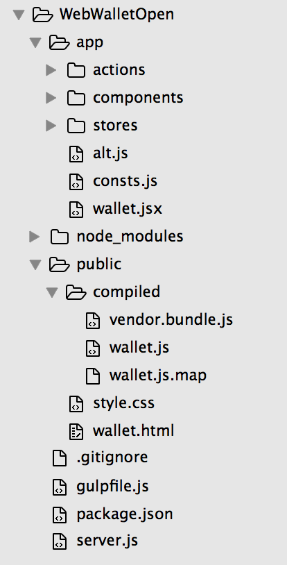
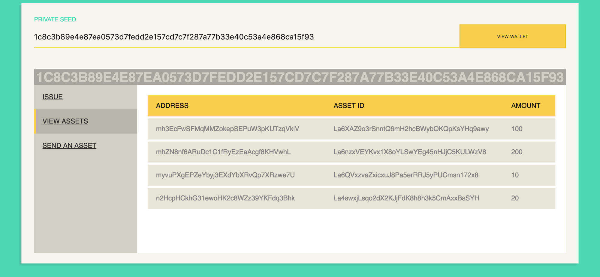
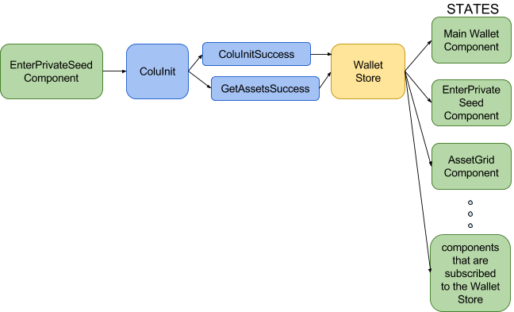

<html>

<head>
    <meta content="text/html; charset=UTF-8" http-equiv="content-type">
    
</head>

<body class="c35 c40">
    <h2 class="c25 c15" id="h.8jrmjksm1elb">Colu Wallet with NodeJS, React and Alt.</h2>
    
In this tutorial we will be using the NodeJS&nbsp;with Express, Colu SDK (<a class="c28" href="https://www.google.com/url?q=http://documentation.colu.co/&amp;sa=D&amp;ust=1469009072334000&amp;usg=AFQjCNGBzWgeCuQPWZMJBWcrZSKbKsPyfg">http://documentation.colu.co</a>), React&nbsp;and Alt&nbsp;to build a simple wallet App. Although we didn&rsquo;t necessarily have to, we also included React Routes&nbsp;for the sake of learning. Our app will initialize using a given private key (or generates one if none is given), shows a list of assets the wallet contains, issue a new asset and send an asset to a phone number or address.

    

    <h2 class="c25 c15" id="h.gzytu6wytnrd">Step 1. Create server</h2>
    
Create a new directory coluwallet. Inside, create 2 empty files package.json&nbsp;and server.js. Paste the following into package.json:

    

    
{

    
    
&nbsp; &quot;dependencies&quot;: {

    
&nbsp; &nbsp; &quot;alt&quot;: &quot;^0.17.8&quot;,

    
&nbsp; &nbsp; &quot;colu&quot;: &quot;^0.10.21&quot;,

    
&nbsp; &nbsp; &quot;express&quot;: &quot;4.13.3&quot;,

    
&nbsp; &nbsp; &quot;hiredis&quot;: &quot;^0.5.0&quot;,

    
&nbsp; &nbsp; &quot;react&quot;: &quot;^15.2.1&quot;,

    
&nbsp; &nbsp; &quot;react-dom&quot;: &quot;^15.2.1&quot;,

    
&nbsp; &nbsp; &quot;react-router&quot;: &quot;^2.5.2&quot;

    
&nbsp; },

    
&nbsp; &quot;devDependencies&quot;: {

    
&nbsp; &nbsp; &quot;babel-plugin-transform-react-jsx&quot;: &quot;&gt;= 6.3&quot;,

    
&nbsp; &nbsp; &quot;babel-preset-es2015&quot;: &quot;~6.9.0&quot;,

    
&nbsp; &nbsp; &quot;babel-preset-react&quot;: &quot;&gt;= 6.3&quot;,

    
&nbsp; &nbsp; &quot;babelify&quot;: &quot;^7.2.0&quot;,

    
&nbsp; &nbsp; &quot;gulp&quot;: &quot;^3.9.1&quot;,

    
&nbsp; &nbsp; &quot;gulp-sourcemaps&quot;: &quot;^2.0.0-alpha&quot;,

    
&nbsp; &nbsp; &quot;gulp-util&quot;: &quot;^3.0.7&quot;,

    
&nbsp; &nbsp; &quot;gulp-babel&quot;: &quot;~6.1.2&quot;,

    
&nbsp; &nbsp; &quot;gulp-concat&quot;: &quot;~2.6.0&quot;,

    
&nbsp; &nbsp; &quot;browserify&quot;: &quot;^12.0.1&quot;,

    
&nbsp; &nbsp; &quot;vinyl-buffer&quot;: &quot;^1.0.0&quot;,

    
&nbsp; &nbsp; &quot;vinyl-source-stream&quot;: &quot;^1.1.0&quot;,

    
&nbsp; &nbsp; &quot;watchify&quot;: &quot;^3.6.0&quot;

    
&nbsp; }

    
}

    

    
Run npm install&nbsp;in the Terminal to install the packages that we specified in the package.json. Open server.js&nbsp;and paste the following code. It&rsquo;s a very minimal Express application, just enough to get us started:

    

    
var http = require(&#39;http&#39;),

    
&nbsp; &nbsp; express = require(&#39;express&#39;),

    
&nbsp; &nbsp; app = express(),

    
&nbsp; &nbsp; path = require(&#39;path&#39;),

    
&nbsp; &nbsp; server;

    

    
app.set(&#39;port&#39;, 3000);

    

    
app.use(express.static(path.join(__dirname, &#39;public&#39;)));

    

    
server = http.createServer(app).listen(app.get(&#39;port&#39;), function () {

    
&nbsp; &nbsp; console.log(&#39;Express server listening on port &#39; + app.get(&#39;port&#39;));

    
});

    

    
app.get(&#39;/wallet&#39;, wallet);

    

    
function wallet(req, res) {

    
&nbsp; &nbsp; res.sendFile(path.join(__dirname+&#39;/public/wallet.html&#39;));

    
}

    

    

    
Next, create a new directory public. This is where we are going to place the main html (wallet.html), &nbsp;CSS stylesheet&nbsp;and compiled JavaScript&nbsp;files.

    
Run npm start in the Terminal to make sure our Express app is working without any issues.

    
You should see Express server listening on port 3000&nbsp;message in the Terminal.

    
Our server is ready. It&rsquo;s serving wallet.html file when requesting localhost:3000/wallet.

    

    

    <h2 class="c25 c15" id="h.1pd185hahrmt">Step 2. Build system</h2>
    
We will be using <a class="c28" href="https://www.google.com/url?q=http://gulpjs.com/&amp;sa=D&amp;ust=1469009072359000&amp;usg=AFQjCNExFCIPUpiiNt2VO6hjP9ME99c8uw">Gulp</a>&nbsp;(task manager) and <a class="c28" href="https://www.google.com/url?q=http://browserify.org/&amp;sa=D&amp;ust=1469009072359000&amp;usg=AFQjCNG9BxrvUWBxQLidGn3mGXzGoJUhIQ">Browserify</a>&nbsp;to compile our javascript files in this tutorial. Browserify compiles all the javascript files we need into one file and transforms some of our files from jsx to js (we&rsquo;ll explain this later).

    
Create a new file gulpfile.js&nbsp;and paste the following code:

    

    
Link to gulpfile

    

    

    
Gulp creates two files: vendor.bundle.js &nbsp;(concatenates vendor dependencies: &#39;alt&#39;, &#39;react&#39;, &#39;react-dom&#39;, &#39;react-router&#39;) and wallet.js (concatenates app files and required node_modules). Babelify transforms our files using presets and plugins, in this project we&rsquo;re using React and ES6, therefore presets: [&#39;es2015&#39;, &#39;react&#39;], and we need a plugin to transform&nbsp;jsx&nbsp;to regular&nbsp;js to make it browser readable. Sourcemaps&nbsp;map a concatenated/minified file back to an original state (source file) to be human-readable when debugging.

    
When we run gulp&nbsp;from the command line, watchify&nbsp;re-compiles the bundle files on file changes.

    
Run gulp&nbsp;and see the files being created in your public/compiled&nbsp;folder.

    

    

    <h2 class="c15 c25" id="h.2674wthhgadg">Step 3. Project Structure</h2>
    <h2 class="c15 c29 c7" id="h.o69jquqtjd56">In the public&nbsp;directory create a new file style.css&nbsp;and paste the following: </h2>
    <h2 class="c15 c29 c7 c38" id="h.vu9kwf295fb3"></h2>
    
Link to css

    

    <h2 class="c15 c7 c29" id="h.qxh7tuo8cxao">In the same directory (public) create a new file wallet.html&nbsp;and paste: </h2>
    
&lt;!DOCTYPE html&gt;

    
&lt;html&gt;

    
&lt;head&gt;

    
&nbsp;&nbsp;&nbsp;&nbsp;&nbsp;&nbsp;&nbsp;&nbsp;&lt;title&gt;Colu Wallet&lt;/title&gt;

    
&nbsp;&nbsp;&nbsp;&nbsp;&nbsp;&nbsp;&nbsp;&nbsp;&lt;link rel=&quot;stylesheet&quot; href=&quot;/style.css&quot;&gt;

    
&lt;/head&gt;

    
&lt;body&gt;

    
&nbsp;&nbsp;&nbsp;&nbsp;&nbsp;&nbsp;&nbsp;&nbsp;&lt;div id=&quot;display&quot;&gt;&lt;/div&gt;&nbsp;&nbsp;&nbsp;&nbsp;&nbsp;&nbsp;&nbsp;&nbsp;

    
&lt;script src=&quot;/compiled/vendor.bundle.js&quot;&gt;&lt;/script&gt;

    
&lt;script src=&quot;/compiled/wallet.js&quot;&gt;&lt;/script&gt;

    
&lt;/body&gt;

    
&lt;/html&gt;

    

    <h2 class="c15 c29 c7" id="h.nivnts4gcsi1">In the project root, create a new folder app.</h2>
    <h2 class="c15 c29 c7" id="h.oopnyck17cj0">Then inside app&nbsp;create 3 new folders actions, components, stores&nbsp;and 3 empty files alt.js, wallet.jsx and&nbsp;consts.js. Your project directory should look like this:</h2>
    <h2 class="c25 c5" id="h.v9ijgbs0a7w6"></h2>
    <h1 class="c15 c33" id="h.av0fitl3jtj">4. A bit about React and Alt</h1>
    <h1 class="c15 c33" id="h.cmhb8t19smpw">4.1 React</h1>
    
React is a JavaScript library for creating user interfaces by Facebook and Instagram. Many people choose to think of React as the V&nbsp;in <a class="c28" href="https://www.google.com/url?q=https://en.wikipedia.org/wiki/Model%25E2%2580%2593view%25E2%2580%2593controller&amp;sa=D&amp;ust=1469009072374000&amp;usg=AFQjCNEcnBOMLIytS-nhi_JBJhXNuqr3BQ">MVC</a>.

    
React was built to solve one problem: building large applications with data that changes over time. From the React Docs:

    <ul class="c26 lst-kix_dqr48ednmsc2-0 start">
        <li class="c8 c5">Simply express how your app should look at any given point in time, and React will automatically manage all UI updates when your underlying data changes.</li>
        <li class="c5 c8">When the data changes, React conceptually hits the &quot;refresh&quot; button, and knows to only update the changed parts.</li>
        <li class="c5 c39">React is all about building reusable components. In fact, with React the only thing you do is build components. Since they&#39;re so encapsulated (markup and behavior live in the same place), components make code reuse, testing, and separation of concerns easy.</li>
    </ul>
    
React is also very fast thanks to the Virtual DOM and diffing algorithm under the hood. When the data changes, React calculates the minimum number of DOM manipulations needed, then efficiently re-renders the component. 

    
While learning React, the biggest challenge for me was that it required a completely different thinking approach to building UIs. Which is why reading <a class="c28" href="https://www.google.com/url?q=https://facebook.github.io/react/docs/thinking-in-react.html&amp;sa=D&amp;ust=1469009072376000&amp;usg=AFQjCNGHtQYq_LYoisLl-QYPe0lR1Eujew">Thinking in React</a>&nbsp;guide is absolutely a must for anyone who is starting out with React.

    
4.2 JSX Syntax

    
React generates HTML and component trees directly from the JavaScript code such that you can use all of the expressive power of a real programming language to build UIs.

    
In order to make this easier, FB added a very simple, optional&nbsp;HTML-like syntax to create these React tree nodes.

    
JSX lets you create JavaScript objects using HTML syntax.&nbsp;Using gulp, jsx in our app is then converted to regular js to make it browser readable.

    
4.3 Alt

    
We will be using a Flux&nbsp;library called <a class="c28" href="https://www.google.com/url?q=http://alt.js.org/&amp;sa=D&amp;ust=1469009072379000&amp;usg=AFQjCNEhE6hEcdqJMzr0qMSdw_-cRGFhjg">Alt</a>&nbsp;- A true flux compliant library in a very small size. Actions are fire and forget, stores have no setters, you get constants, and Flux&#39;s single dispatcher. Flux is the application architecture that was developed at Facebook for building scalable client-side web applications. Data always flows one way through the application and it is picked up along the way by various subscribers (stores) who are listening to it.&nbsp;

    

    

    

    
5. Colu wallet React structure

    
Our wallet will look like this:

    

    
It consists of the main element &lsquo;display&rsquo; and this is where our main wallet container&nbsp;is going to render (see line: ReactDOM.render(&lt;Wallet /&gt;, document.getElementById(&#39;display&#39;)); in wallet.jsx). The main wallet container consists of two main elements: the&nbsp;Private Seed input form and&nbsp;Wallet Content. Wallet Content has a navigation menu&nbsp;(Issue, View Assets and Send An Asset) while each menu link loads its specific view (Asset Grid, Issue, Asset and Send Asset views). These are our basic components.&nbsp;

    

    
5.1. Main container (entry point)

    
Lets look at our main wallet container wallet.jsx:

    
We create the component with&nbsp;var Wallet = React.createClass and render it with ReactDOM.render(&lt;Wallet /&gt;, document.getElementById(&#39;display&#39;)).&nbsp;

    
render(): &nbsp;All components in React have a&nbsp;render()&nbsp;method. It always returns a single child element. The HTML markup above is <a class="c28" href="https://www.google.com/url?q=https://facebook.github.io/react/docs/jsx-in-depth.html&amp;sa=D&amp;ust=1469009072385000&amp;usg=AFQjCNGjUxX-n54GTEDxI7BA3KI6jzy43Q">JSX</a>. As far syntax goes, it is just slightly different from HTML, for example className instead of class to define CSS classes. 

    
<a class="c28" href="https://www.google.com/url?q=https://facebook.github.io/react/docs/component-specs.html%23mounting-componentdidmount&amp;sa=D&amp;ust=1469009072386000&amp;usg=AFQjCNH7i16X_OQwet83CczPhqBSkWg6Ag">componentDidMount</a>(): This method in React is the closest thing to <a class="c28" href="https://www.google.com/url?q=https://learn.jquery.com/using-jquery-core/document-ready/&amp;sa=D&amp;ust=1469009072387000&amp;usg=AFQjCNH7idQf7keZWNMk4_f-Xn-CSftugQ">$(document).ready</a>&nbsp;in jQuery. This method runs once (<a class="c28" href="https://www.google.com/url?q=https://facebook.github.io/react/docs/component-specs.html%23mounting-componentdidmount&amp;sa=D&amp;ust=1469009072387000&amp;usg=AFQjCNEFp6HxolhoxeYNCatLQqmwROU86A">only on the client</a>) immediately after initial rendering of the component. This is where you would typically initialize third-party libraries and jQuery plugins.

    

    
Link to wallet.jsx

    

    
Before the our main component loads, in componentWillMount,&nbsp;we check if user&rsquo;s private seed is in local storage (means, we have already initialized this private seed&rsquo;s wallet once and set it&rsquo;s private seed in local storage). If it is, we initialize Colu with that private seed.

    
There are three options to render this component: 

    <ol class="c26 lst-kix_lu5xpz4f6ph3-0 start" start="1">
        <li class="c15 c22">When Colu is already initialized with the private seed that was stored in local storage: we display EnterPrivateSeed&nbsp;component and WalletRouter&nbsp;component which loads the Navigation Menu&nbsp;and routes to view&nbsp;components.</li>
        <li class="c15 c22">When we are waiting for Colu to initialize we display EnterPrivateSeed&nbsp;component and &lsquo;loading..&rsquo;</li>
        <li class="c15 c22">There was no private seed in localstorage (a new user), we display only the EnterPrivateSeed.</li>
    </ol>
    

    
We subscribe to our Alt&rsquo;s store (WalletStore)&nbsp;in componentDidMount&nbsp;method and update this component&#39;s state with what&#39;s in the&nbsp;WalletStore in&nbsp;onChange&nbsp;method. &nbsp;We stop updating component&#39;s state once it&#39;s not active in&nbsp;componentWillUnmount. 

    

    
5.2. Wallet Router

    
Our wallet&rsquo;s router is a component that returns Router (we use &nbsp;Router&nbsp;from react-router). 

    
var routes = {

    
&nbsp; &nbsp; path: &#39;/&#39;,

    
&nbsp; &nbsp; component: Container,

    
&nbsp; &nbsp; childRoutes: [

    
&nbsp; &nbsp; &nbsp; &nbsp; { path: &#39;/issue&#39;, component: IssueAsset },

    
&nbsp; &nbsp; &nbsp; &nbsp; { path: &#39;/assets&#39;, component: AssetsGrid, renderStyle: consts.assetRenderStyle.grid},

    
&nbsp; &nbsp; &nbsp; &nbsp; { path: &#39;/sendAsset&#39;, component: SendAsset}

    
&nbsp; &nbsp; ]

    
};

    

    
var WalletRouter = React.createClass({

    
&nbsp;&nbsp;&nbsp;&nbsp;&nbsp;&nbsp;&nbsp;&nbsp;render: function () {

    
&nbsp;&nbsp;&nbsp;&nbsp;&nbsp;&nbsp;&nbsp;&nbsp;&nbsp;&nbsp;&nbsp;&nbsp;&nbsp;&nbsp;&nbsp;&nbsp;return (

    
&nbsp;&nbsp;&nbsp;&nbsp;&nbsp;&nbsp;&nbsp;&nbsp;&nbsp;&nbsp;&nbsp;&nbsp;&nbsp;&nbsp;&nbsp;&nbsp;&nbsp;&nbsp;&nbsp;&nbsp;&nbsp;&nbsp;&nbsp;&nbsp;&lt;Router routes={routes} /&gt;

    
&nbsp;&nbsp;&nbsp;&nbsp;&nbsp;&nbsp;&nbsp;&nbsp;&nbsp;&nbsp;&nbsp;&nbsp;&nbsp;&nbsp;&nbsp;&nbsp;);

    
&nbsp;&nbsp;&nbsp;&nbsp;&nbsp;&nbsp;&nbsp;&nbsp;}

    
});

    

    
module.exports = WalletRouter;

    

    
Router has routes: I defined routes using JS and not JSX syntax to solve a React warning about trying to update the routes (Alt does that). This way they are static so it doesn&rsquo;t try to update them.

    

    
var Container = React.createClass({

    
&nbsp;&nbsp;&nbsp;&nbsp;&nbsp;&nbsp;&nbsp;&nbsp;render: function () {

    
&nbsp;&nbsp;&nbsp;&nbsp;&nbsp;&nbsp;&nbsp;&nbsp;&nbsp;&nbsp;&nbsp;&nbsp;&nbsp;&nbsp;&nbsp;&nbsp;return (

    
&nbsp;&nbsp;&nbsp;&nbsp;&nbsp;&nbsp;&nbsp;&nbsp;&nbsp;&nbsp;&nbsp;&nbsp;&nbsp;&nbsp;&nbsp;&nbsp;&nbsp;&nbsp;&nbsp;&nbsp;&nbsp;&nbsp;&nbsp;&nbsp;&lt;div className=&quot;wallet-content&quot;&gt;

    
&nbsp;&nbsp;&nbsp;&nbsp;&nbsp;&nbsp;&nbsp;&nbsp;&nbsp;&nbsp;&nbsp;&nbsp;&nbsp;&nbsp;&nbsp;&nbsp;&nbsp;&nbsp;&nbsp;&nbsp;&nbsp;&nbsp;&nbsp;&nbsp;&nbsp;&nbsp;&nbsp;&nbsp;&nbsp;&nbsp;&nbsp;&nbsp;&lt;Nav /&gt;

    
&nbsp;&nbsp;&nbsp;&nbsp;&nbsp;&nbsp;&nbsp;&nbsp;&nbsp;&nbsp;&nbsp;&nbsp;&nbsp;&nbsp;&nbsp;&nbsp;&nbsp;&nbsp;&nbsp;&nbsp;&nbsp;&nbsp;&nbsp;&nbsp;&nbsp;&nbsp;&nbsp;&nbsp;&nbsp;&nbsp;&nbsp;&nbsp;&nbsp;&nbsp;&nbsp;&nbsp;&nbsp;&nbsp;&nbsp;&nbsp;{this.props.children}

    
&nbsp;&nbsp;&nbsp;&nbsp;&nbsp;&nbsp;&nbsp;&nbsp;&nbsp;&nbsp;&nbsp;&nbsp;&nbsp;&nbsp;&nbsp;&nbsp;&nbsp;&nbsp;&nbsp;&nbsp;&nbsp;&nbsp;&nbsp;&nbsp;&lt;/div&gt;

    
&nbsp;&nbsp;&nbsp;&nbsp;&nbsp;&nbsp;&nbsp;&nbsp;&nbsp;&nbsp;&nbsp;&nbsp;&nbsp;&nbsp;&nbsp;&nbsp;);

    
&nbsp;&nbsp;&nbsp;&nbsp;&nbsp;&nbsp;&nbsp;&nbsp;}

    
});

    

    
{this.props.children} renders the active child route handler. The reason for nesting routes this particular way is because we are going to place Nav menu (which is constant along all the routes) next to the active route, inside the Container component.

    

    

    
5.3 Nav Container

    
In the Nav menu container we use the Link from &lsquo;react-router&rsquo; to link to the routes.

    

    
&nbsp;&nbsp;&nbsp;&nbsp;&nbsp;&nbsp;&nbsp;&nbsp;render: function () {

    
&nbsp;&nbsp;&nbsp;&nbsp;&nbsp;&nbsp;&nbsp;&nbsp;&nbsp;&nbsp;&nbsp;&nbsp;&nbsp;&nbsp;&nbsp;&nbsp;return (

    
&nbsp;&nbsp;&nbsp;&nbsp;&nbsp;&nbsp;&nbsp;&nbsp;&nbsp;&nbsp;&nbsp;&nbsp;&nbsp;&nbsp;&nbsp;&nbsp;&nbsp;&nbsp;&nbsp;&nbsp;&nbsp;&nbsp;&nbsp;&nbsp;&lt;div className=&quot;wallet-nav&quot;&gt;

    
&nbsp;&nbsp;&nbsp;&nbsp;&nbsp;&nbsp;&nbsp;&nbsp;&nbsp;&nbsp;&nbsp;&nbsp;&nbsp;&nbsp;&nbsp;&nbsp;&nbsp;&nbsp;&nbsp;&nbsp;&nbsp;&nbsp;&nbsp;&nbsp;&nbsp;&nbsp;&nbsp;&nbsp;&nbsp;&nbsp;&nbsp;&nbsp;&lt;Link className=&quot;btn nav-btn&quot; to=&#39;/issue&#39;&gt;ISSUE&lt;/Link&gt;

    
&nbsp;&nbsp;&nbsp;&nbsp;&nbsp;&nbsp;&nbsp;&nbsp;&nbsp;&nbsp;&nbsp;&nbsp;&nbsp;&nbsp;&nbsp;&nbsp;&nbsp;&nbsp;&nbsp;&nbsp;&nbsp;&nbsp;&nbsp;&nbsp;&nbsp;&nbsp;&nbsp;&nbsp;&nbsp;&nbsp;&nbsp;&nbsp;&lt;Link className=&quot;btn nav-btn&quot; to=&#39;/assets&#39;&gt;VIEW ASSETS&lt;/Link&gt;

    
&nbsp;&nbsp;&nbsp;&nbsp;&nbsp;&nbsp;&nbsp;&nbsp;&nbsp;&nbsp;&nbsp;&nbsp;&nbsp;&nbsp;&nbsp;&nbsp;&nbsp;&nbsp;&nbsp;&nbsp;&nbsp;&nbsp;&nbsp;&nbsp;&nbsp;&nbsp;&nbsp;&nbsp;&nbsp;&nbsp;&nbsp;&nbsp;&lt;Link className=&quot;btn nav-btn&quot; to=&#39;/sendAsset&#39;&gt;SEND AN ASSET&lt;/Link&gt;

    
&nbsp;&nbsp;&nbsp;&nbsp;&nbsp;&nbsp;&nbsp;&nbsp;&nbsp;&nbsp;&nbsp;&nbsp;&nbsp;&nbsp;&nbsp;&nbsp;&nbsp;&nbsp;&nbsp;&nbsp;&nbsp;&nbsp;&nbsp;&nbsp;&lt;/div&gt;

    
&nbsp;&nbsp;&nbsp;&nbsp;&nbsp;&nbsp;&nbsp;&nbsp;&nbsp;&nbsp;&nbsp;&nbsp;&nbsp;&nbsp;&nbsp;&nbsp;);

    
&nbsp;&nbsp;&nbsp;&nbsp;&nbsp;&nbsp;&nbsp;&nbsp;}

    

    
5.4 EnterPrivateSeed Container

    

    

    
In getInitialState we get the state from the store:

    

    
var EnterPrivateSeed = React.createClass({

    
&nbsp;&nbsp;&nbsp;&nbsp;&nbsp;&nbsp;&nbsp;&nbsp;getInitialState: function() {

    
&nbsp;&nbsp;&nbsp;&nbsp;&nbsp;&nbsp;&nbsp;&nbsp;&nbsp;&nbsp;&nbsp;&nbsp;&nbsp;&nbsp;&nbsp;&nbsp;return WalletStore.getState();

    
&nbsp;&nbsp;&nbsp;&nbsp;&nbsp;&nbsp;&nbsp;&nbsp;},

    
&nbsp;&nbsp;&nbsp;&nbsp;&nbsp;&nbsp;&nbsp;&nbsp;componentDidMount: function() {

    
&nbsp;&nbsp;&nbsp;&nbsp;&nbsp;&nbsp;&nbsp;&nbsp;&nbsp;&nbsp;&nbsp;&nbsp;&nbsp;&nbsp;&nbsp;&nbsp;WalletStore.listen(this.onChange);

    
&nbsp;&nbsp;&nbsp;&nbsp;&nbsp;&nbsp;&nbsp;&nbsp;},

    
&nbsp;&nbsp;&nbsp;&nbsp;&nbsp;&nbsp;&nbsp;&nbsp;onChange: function(state) {

    
&nbsp;&nbsp;&nbsp;&nbsp;&nbsp;&nbsp;&nbsp;&nbsp;&nbsp;&nbsp;&nbsp;&nbsp;&nbsp;&nbsp;&nbsp;&nbsp;this.setState(state);

    
&nbsp;&nbsp;&nbsp;&nbsp;&nbsp;&nbsp;&nbsp;&nbsp;},

    
&nbsp;&nbsp;&nbsp;&nbsp;&nbsp;&nbsp;&nbsp;&nbsp;componentWillUnmount: function() {

    
&nbsp;&nbsp;&nbsp;&nbsp;&nbsp;&nbsp;&nbsp;&nbsp;&nbsp;&nbsp;&nbsp;&nbsp;&nbsp;&nbsp;&nbsp;&nbsp;WalletStore.unlisten(this.onChange);

    
&nbsp;&nbsp;&nbsp;&nbsp;&nbsp;&nbsp;&nbsp;&nbsp;},

    

    
In handleSubmit&nbsp;we deal with the click logic, and fire Action that will talk to Colu SDK and initialize the wallet with given private seed. if none is entered, colu sdk will generate a random one on initialization. Action will update the Store, and all the components that are subscribed to that store will update their state with what&rsquo;s in the store.

    

    
&nbsp;&nbsp;&nbsp;&nbsp;&nbsp;&nbsp;&nbsp;&nbsp;handleSubmit: function (e) {

    
&nbsp;&nbsp;&nbsp;&nbsp;&nbsp;&nbsp;&nbsp;&nbsp;&nbsp;&nbsp;&nbsp;&nbsp;&nbsp;&nbsp;&nbsp;&nbsp;var privateSeed = this.refs.privateSeed.value;

    
&nbsp;&nbsp;&nbsp;&nbsp;&nbsp;&nbsp;&nbsp;&nbsp;&nbsp;&nbsp;&nbsp;&nbsp;&nbsp;&nbsp;&nbsp;&nbsp;e.preventDefault();

    
&nbsp;&nbsp;&nbsp;&nbsp;&nbsp;&nbsp;&nbsp;&nbsp;&nbsp;&nbsp;&nbsp;&nbsp;&nbsp;&nbsp;&nbsp;&nbsp;ColuActions.coluInit(privateSeed);

    
&nbsp;&nbsp;&nbsp;&nbsp;&nbsp;&nbsp;&nbsp;&nbsp;},

    
&nbsp;&nbsp;&nbsp;&nbsp;&nbsp;&nbsp;&nbsp;&nbsp;render: function () {

    
&nbsp;&nbsp;&nbsp;&nbsp;&nbsp;&nbsp;&nbsp;&nbsp;&nbsp;&nbsp;&nbsp;&nbsp;&nbsp;&nbsp;&nbsp;&nbsp;//Build the Enter Private Seed form

    
&nbsp;&nbsp;&nbsp;&nbsp;&nbsp;&nbsp;&nbsp;&nbsp;&nbsp;&nbsp;&nbsp;&nbsp;&nbsp;&nbsp;&nbsp;&nbsp;return (

    
&nbsp;&nbsp;&nbsp;&nbsp;&nbsp;&nbsp;&nbsp;&nbsp;&nbsp;&nbsp;&nbsp;&nbsp;&nbsp;&nbsp;&nbsp;&nbsp;&nbsp;&nbsp;&nbsp;&nbsp;&nbsp;&nbsp;&nbsp;&nbsp;&lt;form className=&quot;enter-privateseed-form&quot;&gt;

    
&nbsp;&nbsp;&nbsp;&nbsp;&nbsp;&nbsp;&nbsp;&nbsp;&nbsp;&nbsp;&nbsp;&nbsp;&nbsp;&nbsp;&nbsp;&nbsp;&nbsp;&nbsp;&nbsp;&nbsp;&nbsp;&nbsp;&nbsp;&nbsp;&nbsp;&nbsp;&nbsp;&nbsp;&nbsp;&nbsp;&nbsp;&nbsp;&lt;div className = &quot;group privateseed&quot;&gt;

    
&nbsp;&nbsp;&nbsp;&nbsp;&nbsp;&nbsp;&nbsp;&nbsp;&nbsp;&nbsp;&nbsp;&nbsp;&nbsp;&nbsp;&nbsp;&nbsp;&nbsp;&nbsp;&nbsp;&nbsp;&nbsp;&nbsp;&nbsp;&nbsp;&nbsp;&nbsp;&nbsp;&nbsp;&nbsp;&nbsp;&nbsp;&nbsp;&nbsp;&nbsp;&nbsp;&nbsp;&nbsp;&nbsp;&nbsp;&nbsp;&lt;div className=&quot;privateseed-input&quot;&gt;

    
&nbsp;&nbsp;&nbsp;&nbsp;&nbsp;&nbsp;&nbsp;&nbsp;&nbsp;&nbsp;&nbsp;&nbsp;&nbsp;&nbsp;&nbsp;&nbsp;&nbsp;&nbsp;&nbsp;&nbsp;&nbsp;&nbsp;&nbsp;&nbsp;&nbsp;&nbsp;&nbsp;&nbsp;&nbsp;&nbsp;&nbsp;&nbsp;&nbsp;&nbsp;&nbsp;&nbsp;&nbsp;&nbsp;&nbsp;&nbsp;&nbsp;&nbsp;&nbsp;&nbsp;&nbsp;&nbsp;&nbsp;&nbsp;&lt;input name=&quot;privateSeed&quot; ref=&quot;privateSeed&quot; /&gt;

    
&nbsp;&nbsp;&nbsp;&nbsp;&nbsp;&nbsp;&nbsp;&nbsp;&nbsp;&nbsp;&nbsp;&nbsp;&nbsp;&nbsp;&nbsp;&nbsp;&nbsp;&nbsp;&nbsp;&nbsp;&nbsp;&nbsp;&nbsp;&nbsp;&nbsp;&nbsp;&nbsp;&nbsp;&nbsp;&nbsp;&nbsp;&nbsp;&nbsp;&nbsp;&nbsp;&nbsp;&nbsp;&nbsp;&nbsp;&nbsp;&nbsp;&nbsp;&nbsp;&nbsp;&nbsp;&nbsp;&nbsp;&nbsp;&lt;span className=&quot;bar&quot;&gt;&lt;/span&gt;

    
&nbsp;&nbsp;&nbsp;&nbsp;&nbsp;&nbsp;&nbsp;&nbsp;&nbsp;&nbsp;&nbsp;&nbsp;&nbsp;&nbsp;&nbsp;&nbsp;&nbsp;&nbsp;&nbsp;&nbsp;&nbsp;&nbsp;&nbsp;&nbsp;&nbsp;&nbsp;&nbsp;&nbsp;&nbsp;&nbsp;&nbsp;&nbsp;&nbsp;&nbsp;&nbsp;&nbsp;&nbsp;&nbsp;&nbsp;&nbsp;&nbsp;&nbsp;&nbsp;&nbsp;&nbsp;&nbsp;&nbsp;&nbsp;&lt;label className=&quot;enter&quot;&gt;Private Seed&lt;/label&gt;

    
&nbsp;&nbsp;&nbsp;&nbsp;&nbsp;&nbsp;&nbsp;&nbsp;&nbsp;&nbsp;&nbsp;&nbsp;&nbsp;&nbsp;&nbsp;&nbsp;&nbsp;&nbsp;&nbsp;&nbsp;&nbsp;&nbsp;&nbsp;&nbsp;&nbsp;&nbsp;&nbsp;&nbsp;&nbsp;&nbsp;&nbsp;&nbsp;&nbsp;&nbsp;&nbsp;&nbsp;&nbsp;&nbsp;&nbsp;&nbsp;&lt;/div&gt;

    
&nbsp;&nbsp;&nbsp;&nbsp;&nbsp;&nbsp;&nbsp;&nbsp;&nbsp;&nbsp;&nbsp;&nbsp;&nbsp;&nbsp;&nbsp;&nbsp;&nbsp;&nbsp;&nbsp;&nbsp;&nbsp;&nbsp;&nbsp;&nbsp;&nbsp;&nbsp;&nbsp;&nbsp;&nbsp;&nbsp;&nbsp;&nbsp;&nbsp;&nbsp;&nbsp;&nbsp;&nbsp;&nbsp;&nbsp;&nbsp;&lt;button className=&quot;btn&quot; type=&quot;submit&quot; ref=&quot;submitButton&quot; onClick={this.handleSubmit}&gt;VIEW WALLET&lt;/button&gt;

    
&nbsp;&nbsp;&nbsp;&nbsp;&nbsp;&nbsp;&nbsp;&nbsp;&nbsp;&nbsp;&nbsp;&nbsp;&nbsp;&nbsp;&nbsp;&nbsp;&nbsp;&nbsp;&nbsp;&nbsp;&nbsp;&nbsp;&nbsp;&nbsp;&nbsp;&nbsp;&nbsp;&nbsp;&nbsp;&nbsp;&nbsp;&nbsp;&lt;/div&gt;

    
&nbsp;&nbsp;&nbsp;&nbsp;&nbsp;&nbsp;&nbsp;&nbsp;&nbsp;&nbsp;&nbsp;&nbsp;&nbsp;&nbsp;&nbsp;&nbsp;&nbsp;&nbsp;&nbsp;&nbsp;&nbsp;&nbsp;&nbsp;&nbsp;&nbsp;&nbsp;&nbsp;&nbsp;&nbsp;&nbsp;&nbsp;&nbsp;&lt;Status/&gt;

    
&nbsp;&nbsp;&nbsp;&nbsp;&nbsp;&nbsp;&nbsp;&nbsp;&nbsp;&nbsp;&nbsp;&nbsp;&nbsp;&nbsp;&nbsp;&nbsp;&nbsp;&nbsp;&nbsp;&nbsp;&nbsp;&nbsp;&nbsp;&nbsp;&lt;/form&gt;

    
&nbsp;&nbsp;&nbsp;&nbsp;&nbsp;&nbsp;&nbsp;&nbsp;&nbsp;&nbsp;&nbsp;&nbsp;&nbsp;&nbsp;&nbsp;&nbsp;);

    
&nbsp;&nbsp;&nbsp;&nbsp;&nbsp;&nbsp;&nbsp;&nbsp;}

    
});

    

    
module.exports = EnterPrivateSeed;

    

    
5.5 Actions

    

    
In the action folder, create a file ColuActions.js

    

    
Alt will create these actions on module.exports:

    

    
function ColuActions() {

    
&nbsp;&nbsp;&nbsp;&nbsp;&nbsp;&nbsp;&nbsp;&nbsp;this.generateActions(

    
&nbsp;&nbsp;&nbsp;&nbsp;&nbsp;&nbsp;&nbsp;&nbsp;&nbsp;&nbsp;&nbsp;&nbsp;&nbsp;&nbsp;&nbsp;&nbsp;&#39;coluInitSuccess&#39;,

    
&nbsp;&nbsp;&nbsp;&nbsp;&nbsp;&nbsp;&nbsp;&nbsp;&nbsp;&nbsp;&nbsp;&nbsp;&nbsp;&nbsp;&nbsp;&nbsp;&#39;actionFailed&#39;,

    
&nbsp;&nbsp;&nbsp;&nbsp;&nbsp;&nbsp;&nbsp;&nbsp;&nbsp;&nbsp;&nbsp;&nbsp;&nbsp;&nbsp;&nbsp;&nbsp;&#39;getAssetsSuccess&#39;

    
&nbsp;&nbsp;&nbsp;&nbsp;&nbsp;&nbsp;&nbsp;&nbsp;);

    
}

    

    

    
Initialize Colu sdk:

    

    
ColuActions.prototype.coluInit&nbsp;= function(privateSeed) {

    
&nbsp; var settings = {

    
&nbsp;&nbsp;&nbsp;&nbsp;&nbsp;&nbsp;&nbsp;&nbsp;&nbsp;&nbsp;&nbsp;&nbsp;&nbsp;&nbsp;&nbsp;&nbsp;network: &#39;testnet&#39;,

    
&nbsp;&nbsp;&nbsp;&nbsp;&nbsp;&nbsp;&nbsp;&nbsp;&nbsp;&nbsp;&nbsp;&nbsp;&nbsp;&nbsp;&nbsp;&nbsp;privateSeed: privateSeed,

    
&nbsp;&nbsp;&nbsp;&nbsp;&nbsp;&nbsp;&nbsp;&nbsp;&nbsp;&nbsp;&nbsp;&nbsp;&nbsp;&nbsp;&nbsp;&nbsp;events: true,

    
&nbsp;&nbsp;&nbsp;&nbsp;&nbsp;&nbsp;&nbsp;&nbsp;&nbsp;&nbsp;&nbsp;&nbsp;&nbsp;&nbsp;&nbsp;&nbsp;eventsSecure: false

    
&nbsp;&nbsp;&nbsp;&nbsp;&nbsp;&nbsp;&nbsp;&nbsp;},

    
&nbsp;&nbsp;&nbsp;&nbsp;&nbsp;&nbsp;&nbsp;&nbsp;that = this;

    

    
&nbsp;&nbsp;&nbsp;&nbsp;&nbsp;&nbsp;&nbsp;&nbsp;function getAssetsCallback(err, assets) {

    
&nbsp;&nbsp;&nbsp;&nbsp;&nbsp;&nbsp;&nbsp;&nbsp;&nbsp;&nbsp;&nbsp;&nbsp;&nbsp;&nbsp;&nbsp;&nbsp;if (err) {

    

    
For errors we have actionFailed action that will update the store with error:

    

    
&nbsp;&nbsp;&nbsp;&nbsp;&nbsp;&nbsp;&nbsp;&nbsp;&nbsp;&nbsp;&nbsp;&nbsp;&nbsp;&nbsp;&nbsp;&nbsp;&nbsp;&nbsp;&nbsp;&nbsp;&nbsp;&nbsp;&nbsp;&nbsp;return that.actions.actionFailed(JSON.stringify(err));

    
&nbsp;&nbsp;&nbsp;&nbsp;&nbsp;&nbsp;&nbsp;&nbsp;&nbsp;&nbsp;&nbsp;&nbsp;&nbsp;&nbsp;&nbsp;&nbsp;}

    
&nbsp;&nbsp;&nbsp;&nbsp;&nbsp;&nbsp;&nbsp;&nbsp;&nbsp;&nbsp;&nbsp;&nbsp;&nbsp;&nbsp;&nbsp;&nbsp;//Update the store with assets

    
&nbsp;&nbsp;&nbsp;&nbsp;&nbsp;&nbsp;&nbsp;&nbsp;&nbsp;&nbsp;&nbsp;&nbsp;&nbsp;&nbsp;&nbsp;&nbsp;that.actions.getAssetsSuccess({assets: assets});

    
&nbsp;&nbsp;&nbsp;&nbsp;&nbsp;&nbsp;&nbsp;&nbsp;}

    

    
&nbsp;&nbsp;&nbsp;&nbsp;&nbsp;&nbsp;&nbsp;&nbsp;try {

    
&nbsp;&nbsp;&nbsp;&nbsp;&nbsp;&nbsp;&nbsp;&nbsp;&nbsp;&nbsp;&nbsp;&nbsp;&nbsp;&nbsp;&nbsp;&nbsp;ColuActions.colu = new Colu(settings);

    
&nbsp;&nbsp;&nbsp;&nbsp;&nbsp;&nbsp;&nbsp;&nbsp;

    
&nbsp;&nbsp;&nbsp;&nbsp;&nbsp;&nbsp;&nbsp;&nbsp;&nbsp;&nbsp;&nbsp;&nbsp;&nbsp;&nbsp;&nbsp;&nbsp;ColuActions.colu.on(&#39;connect&#39;, function () {

    

    
When a new transaction happens (issue, send, receive etc) we get the updated assets:

    

    
&nbsp;&nbsp;&nbsp;&nbsp;&nbsp;&nbsp;&nbsp;&nbsp;&nbsp;&nbsp;&nbsp;&nbsp;&nbsp;&nbsp;&nbsp;&nbsp;&nbsp;&nbsp;&nbsp;&nbsp;&nbsp;&nbsp;&nbsp;&nbsp;ColuActions.colu.onNewCCTransaction(function (transaction) {

    
&nbsp;&nbsp;&nbsp;&nbsp;&nbsp;&nbsp;&nbsp;&nbsp;&nbsp;&nbsp;&nbsp;&nbsp;&nbsp;&nbsp;&nbsp;&nbsp;&nbsp;&nbsp;&nbsp;&nbsp;&nbsp;&nbsp;&nbsp;&nbsp;&nbsp;&nbsp;&nbsp;&nbsp;&nbsp;&nbsp;&nbsp;&nbsp;if (transaction) {

    
&nbsp;&nbsp;&nbsp;&nbsp;&nbsp;&nbsp;&nbsp;&nbsp;&nbsp;&nbsp;&nbsp;&nbsp;&nbsp;&nbsp;&nbsp;&nbsp;&nbsp;&nbsp;&nbsp;&nbsp;&nbsp;&nbsp;&nbsp;&nbsp;&nbsp;&nbsp;&nbsp;&nbsp;&nbsp;&nbsp;&nbsp;&nbsp;&nbsp;&nbsp;&nbsp;&nbsp;&nbsp;&nbsp;&nbsp;&nbsp;ColuActions.colu.getAssets(getAssetsCallback);

    
&nbsp;&nbsp;&nbsp;&nbsp;&nbsp;&nbsp;&nbsp;&nbsp;&nbsp;&nbsp;&nbsp;&nbsp;&nbsp;&nbsp;&nbsp;&nbsp;&nbsp;&nbsp;&nbsp;&nbsp;&nbsp;&nbsp;&nbsp;&nbsp;&nbsp;&nbsp;&nbsp;&nbsp;&nbsp;&nbsp;&nbsp;&nbsp;}

    
&nbsp;&nbsp;&nbsp;&nbsp;&nbsp;&nbsp;&nbsp;&nbsp;&nbsp;&nbsp;&nbsp;&nbsp;&nbsp;&nbsp;&nbsp;&nbsp;&nbsp;&nbsp;&nbsp;&nbsp;&nbsp;&nbsp;&nbsp;&nbsp;});

    

    
If no private key is entered, the wallet initialized using a random private key, we retrieve it. Right now there&rsquo;s a bug where no address is generated when the wallet is initialized without the private seed, therefore we getAddress manually.

    

    
&nbsp;&nbsp;&nbsp;&nbsp;&nbsp;&nbsp;&nbsp;&nbsp;&nbsp;&nbsp;&nbsp;&nbsp;&nbsp;&nbsp;&nbsp;&nbsp;&nbsp;&nbsp;&nbsp;&nbsp;&nbsp;&nbsp;&nbsp;&nbsp;if (!privateSeed) {

    
&nbsp;&nbsp;&nbsp;&nbsp;&nbsp;&nbsp;&nbsp;&nbsp;&nbsp;&nbsp;&nbsp;&nbsp;&nbsp;&nbsp;&nbsp;&nbsp;&nbsp;&nbsp;&nbsp;&nbsp;&nbsp;&nbsp;&nbsp;&nbsp;&nbsp;&nbsp;&nbsp;&nbsp;&nbsp;&nbsp;&nbsp;&nbsp;privateSeed = ColuActions.colu.hdwallet.getPrivateSeed();

    
&nbsp;&nbsp;&nbsp;&nbsp;&nbsp;&nbsp;&nbsp;&nbsp;&nbsp;&nbsp;&nbsp;&nbsp;&nbsp;&nbsp;&nbsp;&nbsp;&nbsp;&nbsp;&nbsp;&nbsp;&nbsp;&nbsp;&nbsp;&nbsp;&nbsp;&nbsp;&nbsp;&nbsp;&nbsp;&nbsp;&nbsp;&nbsp;//get an address to be able to do transactions

    
&nbsp;&nbsp;&nbsp;&nbsp;&nbsp;&nbsp;&nbsp;&nbsp;&nbsp;&nbsp;&nbsp;&nbsp;&nbsp;&nbsp;&nbsp;&nbsp;&nbsp;&nbsp;&nbsp;&nbsp;&nbsp;&nbsp;&nbsp;&nbsp;&nbsp;&nbsp;&nbsp;&nbsp;&nbsp;&nbsp;&nbsp;&nbsp;ColuActions.colu.hdwallet.getAddress();

    
&nbsp;&nbsp;&nbsp;&nbsp;&nbsp;&nbsp;&nbsp;&nbsp;&nbsp;&nbsp;&nbsp;&nbsp;&nbsp;&nbsp;&nbsp;&nbsp;&nbsp;&nbsp;&nbsp;&nbsp;&nbsp;&nbsp;&nbsp;&nbsp;}

    

    
If we have successfully initialized the wallet, update the store with the private seed (to be displayed in the wallet content) and continue with getting the assets for this private seed::

    

    
&nbsp;&nbsp;&nbsp;&nbsp;&nbsp;&nbsp;&nbsp;&nbsp;&nbsp;&nbsp;&nbsp;&nbsp;&nbsp;&nbsp;&nbsp;&nbsp;&nbsp;&nbsp;&nbsp;&nbsp;&nbsp;&nbsp;&nbsp;&nbsp;that.actions.coluInitSuccess({privateSeed: privateSeed, error: null});

    
&nbsp;&nbsp;&nbsp;&nbsp;&nbsp;&nbsp;&nbsp;&nbsp;&nbsp;&nbsp;&nbsp;&nbsp;&nbsp;&nbsp;&nbsp;&nbsp;&nbsp;&nbsp;&nbsp;&nbsp;&nbsp;&nbsp;&nbsp;&nbsp;ColuActions.colu.getAssets(getAssetsCallback);

    

    
&nbsp;&nbsp;&nbsp;&nbsp;&nbsp;&nbsp;&nbsp;&nbsp;&nbsp;&nbsp;&nbsp;&nbsp;&nbsp;&nbsp;&nbsp;&nbsp;});

    

    
&nbsp;&nbsp;&nbsp;&nbsp;&nbsp;&nbsp;&nbsp;&nbsp;&nbsp;&nbsp;&nbsp;&nbsp;&nbsp;&nbsp;&nbsp;&nbsp;ColuActions.colu.init();

    
&nbsp;&nbsp;&nbsp;&nbsp;&nbsp;&nbsp;&nbsp;&nbsp;

    
&nbsp;&nbsp;&nbsp;&nbsp;&nbsp;&nbsp;&nbsp;&nbsp;} catch (e) {

    
&nbsp;&nbsp;&nbsp;&nbsp;&nbsp;&nbsp;&nbsp;&nbsp;&nbsp;&nbsp;&nbsp;&nbsp;&nbsp;&nbsp;&nbsp;&nbsp;that.actions.actionFailed(e);

    
&nbsp;&nbsp;&nbsp;&nbsp;&nbsp;&nbsp;&nbsp;&nbsp;}

    
};

    

    

    
module.exports = alt.createActions(ColuActions);

    

    

    
5.6 Wallet Store

    

    
In stores folder create a file walletStore.js

    

    
Update the store with what is passed from the actions:

    

    
function WalletStore() {

    
&nbsp;&nbsp;&nbsp;&nbsp;&nbsp;&nbsp;&nbsp;&nbsp;this.bindActions(ColuActions);

    
&nbsp;&nbsp;&nbsp;&nbsp;&nbsp;&nbsp;&nbsp;&nbsp;this.bindActions(GeneralActions);

    
}

    

    
this.something is the variable in the state that gets updated with what&rsquo;s passed from the action. Notice, alt prepends &lsquo;on&rsquo; to Action name.

    

    
//Colu

    
WalletStore.prototype.onColuInitSuccess&nbsp;= function(obj) {

    
&nbsp;&nbsp;&nbsp;&nbsp;&nbsp;&nbsp;&nbsp;&nbsp;this.privateSeed = obj.privateSeed;

    
&nbsp;&nbsp;&nbsp;&nbsp;&nbsp;&nbsp;&nbsp;&nbsp;this.error = obj.error;

    
&nbsp;&nbsp;&nbsp;&nbsp;&nbsp;&nbsp;&nbsp;&nbsp;localStorage.setItem( &#39;privateSeed&#39;, obj.privateSeed );

    
}

    

    
WalletStore.prototype.onGetAssetsSuccess&nbsp;= function(obj) {

    
&nbsp;&nbsp;&nbsp;&nbsp;&nbsp;&nbsp;&nbsp;&nbsp;this.assets = obj.assets;

    
}

    

    

    

    
//Status messages

    

    
WalletStore.prototype.onActionFailed&nbsp;= function(err) {

    
&nbsp;&nbsp;&nbsp;&nbsp;&nbsp;&nbsp;&nbsp;&nbsp;this.error = &#39;There was an error: &#39; + err.toString();

    
&nbsp;&nbsp;&nbsp;&nbsp;&nbsp;&nbsp;&nbsp;&nbsp;this.updatedStatus = null;

    
}

    

    
module.exports = alt.createStore(WalletStore);

    

    

    
This is what the flow looks like:

    

    

    
TODO: 

    

    <ol class="c26 lst-kix_wp76ufi3ji02-0 start" start="1">
        <li class="c15 c22">getAssetInfo - build data structure on the init and save it in state, and then just get the info on the specific asset</li>
        <li class="c15 c22">sendAsset - move address/phone logic to actions</li>
        <li class="c15 c22">getMetadata - assets should get their respective metadata and display Name and Icon</li>
        <li class="c15 c22">viewAssetHistory - view asset transactions</li>
        <li class="c15 c22">register/login (backup/restore) - allow a colu user to login and fetch their encrypted seed from colu account</li>
        <li class="c15 c22">Multiple wallet support - allow switching between wallets and networks</li>
    </ol>
</body>

</html>
